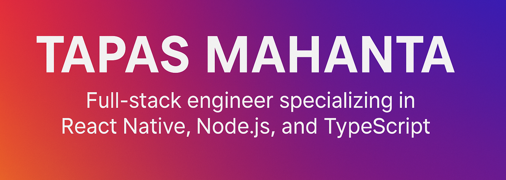

  

# 👋 Hi, I'm Tapas Mahanta

  
  
  
  

**Full-stack engineer specializing in React Native, Node.js and TypeScript. Building scalable cross-platform apps and preparing for MAANG.**

### Full‑Stack Developer | React Native • Node.js • TypeScript • Electron

### 8+ Years Experience | Preparing for MAANG | Building Scalable Cross‑Platform Apps

---

## 🚀 About Me

* Full‑stack engineer with strong experience in **JavaScript, TypeScript, Node.js, MongoDB, React Native, Electron.js**
* Passionate about **high‑performance apps**, clean architecture, testing, and modern tooling
* Currently preparing for **MAANG interviews**
* Interested in **systems design**, **state machines (XState)**, **cross‑platform development**, and **AI‑powered workflows**
* Building a personal portfolio of real‑world, production‑ready apps

---

## 🔥 Featured Projects

### 📱 React Native Mobile App – *Project 1 Placeholder*

*A clean and scalable React Native application with XState-based state management, full TypeScript support, and automated tests.*

* React Native + TypeScript + XState
* Clean architecture + reusable UI components
* Jest & RTL tests
* Offline storage with AsyncStorage / MMKV
* Screenshots & demo link (coming soon)

---

### 💻 Electron Desktop App – *Project 2 Placeholder*

*A cross-platform desktop app built with Electron + Node.js + MongoDB. Focused on performance, modular design, and offline-first functionality.*

* Electron.js + Node.js backend
* MongoDB / NeDB local storage
* IPC communication patterns
* Auto-updater & production bundling
* Screenshots & demo link (coming soon)

---

## 📚 Blog & Technical Writing

### 📝 Current Series: **Building a React Native App with XState**

Topics planned:

1. Why XState is better for complex mobile workflows
2. App architecture with state machines
3. Building screens and navigation
4. Testing XState logic with Jest
5. Deploying the final app

(First post coming soon)

---

## 🧠 Skills

* **Languages:** JavaScript, TypeScript, HTML, CSS
* **Frontend:** React, React Native, Next.js
* **Backend:** Node.js, Express, MongoDB, REST APIs
* **Desktop:** Electron.js
* **Dev Tools:** GitHub Actions, Docker, ESLint, Prettier
* **Testing:** XState tests, Jest, React Testing Library

---

## 🌱 Currently Learning

* Advanced system design
* Scalable API patterns
* MAANG interview patterns
* High-performance React Native architecture

---

## 📬 Connect

* Personal Website: **tapasm.com**
* GitHub: **github.com/tapas100**
* LinkedIn: *Add link here*

---

⭐ **If you like my work, consider starring my repositories!**
